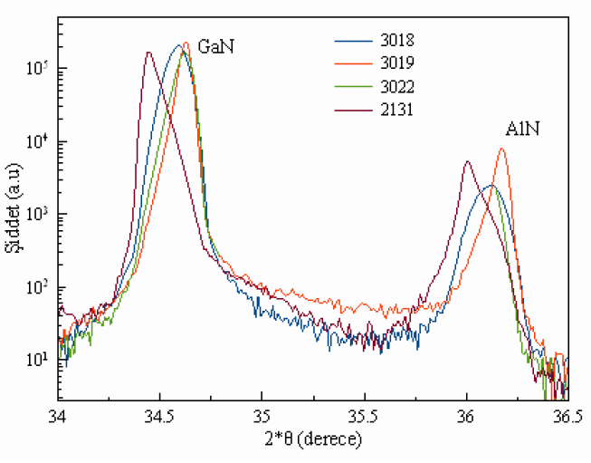

## ULTRATHIN- High-Performance Modelling and Experimental Investigation of Transport and Device Properties of GaN-based High Electron Mobility Transistors with Ultrathin Barriers

### Project Information
* Date: Mar 2015 - Mar 2017
* Funded by: TUBITAK
* Number: 114F508
* Budget: 37.995 Turkish liras

### Project Description

Abstract

Gallium nitride (GaN), which is an important group III-V semiconductor material, has been investigated more widely in the last 15 years. The importance of the material due to its physical properties. Due to its nature, GaN has high energy gap, high thermal conductivity, high melting temperature, low dielectric constant, and high breakdown voltage. Similarly, AlN, InN and the ternary and quaternary alloys of these three materials AlGaN, InGaN, AlInN and AlInGaN shows similar characteristics. These features, provides them available in the production of high frequency power transistors working at higher power and higher temperatures. These power transistors are widely used today in many applications, such as, wireless networking applications, mobile communications, microwave communications and radar applications.

High Electron Mobility Transistors (HEMT) design is more widely known as Heterostructure Field Effect Transistor (HFET). HEMTs are power transistors and the electrical properties of the devices are determined by two-dimensional electron gas (2DEG) which is populated in these structures.

Since 1992, many radical designs of GaN-based HEMT structures, are performed to increase the electrical properties of these structures. However, because of lack of widespread GaN-based substrates, strain induced and so dislocations produces in the structures. In addition, the crystal structure of these structures is polar. Because of all these properties influence the electrical properties of the HEMTs, search for more successful HEMTs is still continuing process.

Today, with the increasing usage of the high frequency / high-power transistors in small scale applications, there is a transition in HEMT structures from micrometer to nanometer scale. The gate lengths under 100 nm are known to be problematic are generally referred to as the short-channel effects in these systems. The most important solution proposal to short-channel effects in recent years is the implementation of ultrathin barrier to the system. Application of ultrathin barrier, with a difficult controllability of the layers of a few nanometers thick, with tensions, polarizations, and applied electric fields be affected by all these variables are seen as a multivariate problem. So that, a transistor grown by a few-nanometer error during operation can lead formation of dislocations. Therefore, electrical properties of these systems may change with an electric field and may lead catastrophic consequences.

### Objectives

In this study, ultra-thin barrier HEMTs will be designed for different barrier materials (AlN, AlGaN, and InAlN) including polarization, voltage and temperature variations, with solving the high-performance self-consistent 2-dimensional Schrödinger-Poisson equations. Band structure, carrier density, depending on the voltage and temperature distributions and their current-voltage characteristics will be calculated. In addition, transconductance and cutoff frequencies, which are important parameters for applications, are planned to obtained from current-voltage data with using analytical expressions.

After design and modelling, the best structures will be grown with Metal Organic Chemical Vapor Deposition (MOCVD) method. After, the electrical properties of these grown structures will be measured. Successful structures will be fabricated as transistors  and then characterized consistently with the previous modelling results. 

This computational study and the proposed experimental methods, may enlight us to better understand ultra-thin barrier HEMT structures and result to look forward for producing transistors without the short-channel effects. We foresee the results of these studies, that can be obtained within two years, will have important positions in both research and practice. Research within the framework provide opportunities for many SCI-indexed publications and proceedings. From the application point-of-view, this study is may result one patent or more. The computational and experimental senior scientists involved in the study are experienced in the subject. In addition, the students planned to be trained in these subjects will be foreseen to become important contributers to our country’s basic science knowledge and promising areas of technology.

### Project Consortium

#### Project Team
* Assoc. Prof. Dr. Beyza SARIKAVAK-LISESIVDIN (PI) (Gazi Univ.)
* Mehmet OZTURK (Gazi Univ.)

#### Other Colleagues, Students and Collaborations
* Prof. Dr. Ekmel OZBAY (Bilkent Univ.)
* Prof. Dr. Mehmet KASAP (Gazi Univ.)
* Prof. Dr. Sefer Bora LISESIVDIN (Gazi Univ.)
* Gokhan ATMACA (Gazi Univ.)
* Polat NARIN (Gazi Univ.)
* Jangeez M. All ABBAS (Gazi Univ.)

### Project Structure
* WP1: Ultrathin Barrier HEMT Design and simulation
* WP2: Ultrathin Barrier HEMT Augmentation and Electrical Characterization
* WP3: Fabrication and Characterization of Transistor structures

### Project News*

#### March 2019
* New article from our project: P. Narin, E. Arslan, M. Ozturk, M. Ozturk, S. B. Lisesivdin, E. Ozbay "Scattering analysis of ultrathin barrier (< 7 nm) GaN-based heterostructures" Appl. Phys. A: Mater. Sci. Process. 125, 278 (2019).

#### June 2017
* New article from our project: J. M. Al Abbas, P. Narin, G. Atmaca, E. Kutlu, B. Sarikavak-Lisesivdin, S. B. Lisesivdin "The effect of doping in different layers on 2DEG for ultrathin-barrier AlN/GaN heterostructures" Optoelectron. Adv. Mater.-Rapid Comm. 11, 328 (2017).

#### April 2017
* New article from our project: J. M. All Abbas, G. Atmaca, P. Narin, E. Kutlu, B. Sarikavak-Lisesivdin, S. B. Lisesivdin "A Comparative Study of AlGaN and InGaN Back-Barriers in Ultrathin-Barrier AlN/GaN Heterostructures" J. Elec. Mater. 46, 5278 (2017). 

#### March 2017
Project is finished.

#### September 2016
* New proceeding from our project: P. Narin, E. Kutlu, G. Atmaca, B. Sarıkavak-Lisesivdin, S. B. Lisesivdin, E. Ozbay "Ultraince Bariyere Sahip AlN/GaN ve InAlN/GaN HEMT Yapıların Yapısal ve Yüzey Özelliklerinin İncelenmesi" 18th National Workshop on Optics, Electro-optics and Photonics, Ankara, P72,(2016). 
* New proceeding from our project: J. M. Al Abbas, G. Atmaca, P. Narin, E. Kutlu, B. Sarikavak-Lisesivdin, S. B. Lisesivdin "Numerical Investigation Of 2DEG Properties In Ultrathin-Barrier AlN/GaN Heterostructures with AlGaN and InGaN Back-Barriers" 18th National Workshop on Optics, Electro-optics and Photonics, Ankara, P47,(2016).
* New proceeding from our project: M. Ozturk, E. Arslan, P. Narin, S. B. Lisesivdin, B. Sarikavak-Lisesivdin, E. Ozbay "Ultraince Bariyerli GaN-Temelli HEMT'lerde Elektron Gazının Elektriksel Özellikleri ve Saçılma Analizleri" 18th National Workshop on Optics, Electro-optics and Photonics, Ankara, P50,(2016).

#### April 2016
* New proceeding from our project: J. M. Al Abbas, P. Narin, E. Kutlu, G. Atmaca, S. B. Lisesivdin, B. Sarikavak-Lisesivdin "P-tipi ve N-tipi InGaN Arka-Bariyerli Ultraince AlInN/GaN Çoklu Yapılarda İki Boyutlu Elektron Gazı" ADIM Physics Congress V, p.163 (2016). 
* New proceeding from our project: J. M. Al Abbas, P. Narin, G. Atmaca, E. Kutlu, S. B. Lisesivdin, B. Sarikavak-Lisesivdin "Ultraince Bariyerli AlN/GaN Çoklu Yapılarda Farklı Katmanların 2BEG Üzerine Etkisi" ADIM Physics Congress V, p.164 (2016).

#### December 2015
* New article from our project: G. Atmaca, P. Narin, B. Sarikavak-Lisesivdin, S. B. Lisesivdin "Two Dimensional Electron Gas in a Hybrid GaN/InGaN/ZnO Heterostructure with Ultrathin InGaN Channel Layer" Physica E 79, 67 (2016).

#### March 2015
Project is started.

*: Project site is prepared after project was finished.
